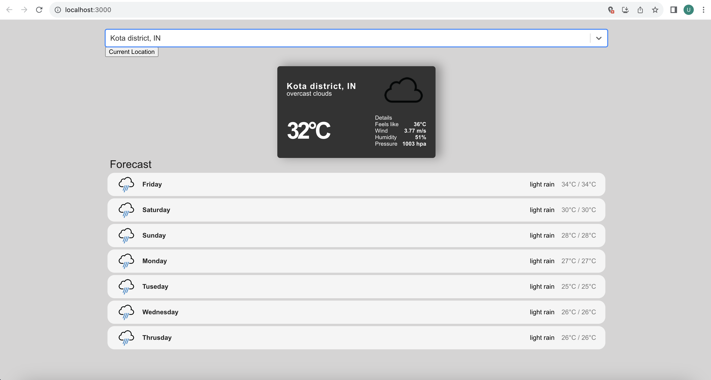

# Weather Application



## Table of Contents

- [Description](#description)
- [Features](#features)
- [Installation](#installation)
- [Usage](#usage)
- [Technologies Used](#technologies-used)

## Description

The Weather Application is a React.js web application that allows users to get current weather conditions and forecasts for different locations. It utilizes weather data from a third-party API to provide accurate and up-to-date information.

## Features

- Search for weather by city name or location coordinates.
- Display current weather conditions including temperature, humidity, wind speed, etc.
- Show a 5-day forecast with daily weather details.
- Responsive design to ensure a great user experience on various devices.


## Installation

To run the Weather Application locally, follow these steps:

1. Clone the repository:

   ```bash
   git clone https://github.com/ujjaval08/Weather_application.git
2. Navigate to the project directory:

   ```bash
   cd weather-app
3. Install the required dependencies:

   ```bash
   npm install
4. Start the development server:

   ```bash
   npm start
5. Open your browser and navigate to http://localhost:3000 to see the app in action.

## Usage
- Enter a city name or coordinates in the search bar.
- Click the "Search" button to retrieve weather information for the chosen location.
- View the current weather conditions and the 5-day forecast.

## Technologies Used
- React.js
- HTML5
- CSS3
- Third-party Weather API (e.g., OpenWeatherApi)


   

